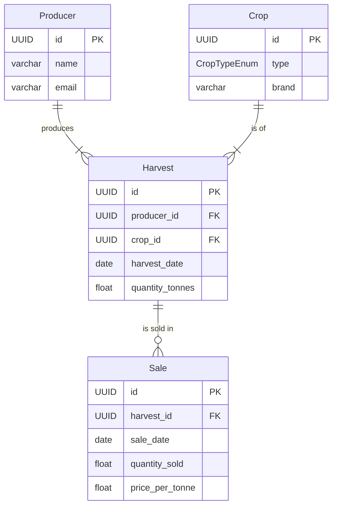

```mermaid
erDiagram
    Producer {
        UUID id PK
        varchar name
        varchar email
    }
    Crop {
        UUID id PK
        CropTypeEnum type
        varchar brand
    }
    Harvest {
        UUID id PK
        UUID producer_id FK
        UUID crop_id FK
        date harvest_date
        float quantity_tonnes
    }
    Sale {
        UUID id PK
        UUID harvest_id FK
        date sale_date
        float quantity_sold
        float price_per_tonne
    }

    Producer ||--|{ Harvest : "produces"
    Crop ||--|{ Harvest : "is of"
    Harvest ||--o{ Sale : "is sold in"
```
