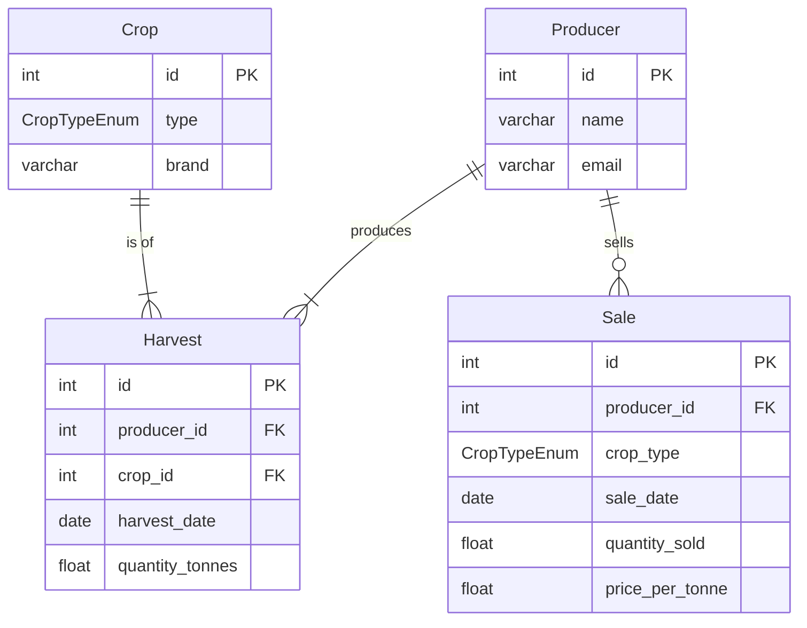

# PWC Backend Assessment

This FastAPI project manages agricultural data, including producers, crops, harvests, and sales. It demonstrates backend best practices with a clean, layered architecture.

---

## 📖 Project Overview

This API provides CRUD operations for:

- **Producers**: Farmers or agricultural companies
- **Crops**: Types of agricultural products
- **Harvests**: Records of harvested crops
- **Sales**: Records of crop sales

The architecture separates concerns into routes (presentation), services (business logic), repositories (data access), and models (domain), following a **layered architecture**.

---

## 🚀 Getting Started

### Prerequisites

- Docker and Docker Compose
- Python 3.13.5
- A `.env` file with the required environment variables

### Environment Variables

Before running the application, copy the example environment file and edit it as needed. Due to the nature of the project these variables, **for now**, are not sensitive.

```bash
cp .env.example .env
```

Edit the new `.env` file in the root directory. Ensure `DATABASE_URL` matches the `POSTGRES` variables. You can use any user, password, and database name you like. Docker will handle database creation for you. 💡

```env
DATABASE_URL=postgresql+asyncpg://usuariopwc:password123@db:5432/pwc_assessment
POSTGRES_USER=usuariopwc
POSTGRES_PASSWORD=password123
POSTGRES_DB=pwc_assessment
LOG_LEVEL=INFO
VERSION=1.0.0
```

### Running the Application

This project includes a `Makefile` to simplify setup and management.

- **Start the application and database:**

  ```bash
  make up
  ```
  This builds the containers and images, managing two services: the `postgres:16` database and the FastAPI app. To view logs or errors, use:

  ```bash
  make logs
  ```

- **Stop the application and remove the database volume:**

  ```bash
  make down
  make delete-volume
  ```

- **Restart the application:**

  ```bash
  make restart
  ```

See the `Makefile` for more useful commands.

---

## 📝 API Documentation

Once running, access the interactive API docs (Swagger UI) at:

**[http://localhost:8000/docs](http://localhost:8000/docs)**

---

## ⚖️ Business Rules Beyond Basic CRUD

- **General**
  - Entities cannot be deleted if they are referenced by another entity. (Database rule)

- **Harvests**
  - Both a Producer and a Crop must exist to create a Harvest.
  - A Harvest cannot be deleted if, after deletion, the Producer would have sold more of that crop type (e.g., soybean, wheat) than their remaining stock.

- **Producers**
  - A Producer cannot be deleted if they still have stock available to sell.

- **Crops**
  - A Crop type (e.g., soybean, wheat) cannot be deleted if it is used in any Harvest or Sale.

- **Sales**
  - A Sale cannot be created if the Producer does not have enough stock of the specified crop type (e.g.,soybean, wheat, etc).
  - A Sale cannot be updated if the new quantity exceeds the Producer's available stock of that crop type.

---

## ⚙️ Technical Details

### Dependency Injection & Design Patterns

- **Dependency Injection**: FastAPI's DI system (`Depends`) manages dependencies like the DB session, repositories, and services are injected where needed, decoupling components and making refactoring easier.
- **Repository Pattern**: Data access logic is encapsulated in repositories (e.g., `ProducerSQLRepository`), separating business logic from database implementation. This allows an easy change of databases services.
- **Service Layer**: Services (e.g., `ProducerService`) contain business logic and depend on repository interfaces, not implementations, ensuring separation of concerns.

### Database Configuration

- **ORM**: SQLAlchemy is used for all DB interactions.
- **Engine**: An async engine is created from `DATABASE_URL`.
- **Session Management**: An async session factory provides sessions per request, ensuring proper cleanup.
- **DI**: A `get_db_session` dependency provides sessions to routes, ensuring each request gets a dedicated session that is closed/rolled back on error.

### Logging

- **Configuration**: A basic logger outputs to the console.
- **Log Level**: Set via the `LOG_LEVEL` env variable. Currently `INFO`.
- **Format**: Logs include timestamp, level, and message.

---

## 🗃️ Database Schema




---


## 🛠️ Troubleshooting

### Port 5432 is already in use

If you get an error that port `5432` is occupied, another service (likely another PostgreSQL instance) is using it. You can resolve this by stopping the conflicting process.

On macOS or Linux, find and kill the process using its PID:

```bash
# Find the process ID (PID) using the port
lsof -i :5432

# Kill the process using its PID
kill -9 <PID>
```
